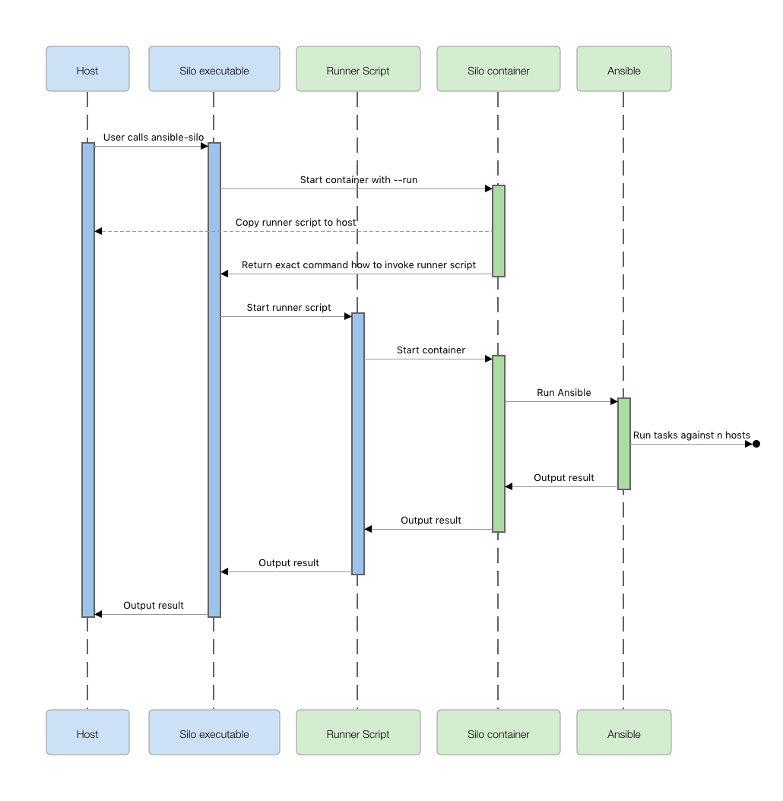

Ansible Silo
============

Table of Contents
-----------------

<!-- TOC -->

- [What problem does Silo solve?](#what-problem-does-silo-solve)
- [How it works](#how-it-works)
    - [Standalone mode](#standalone-mode)
    - [Bundle mode](#bundle-mode)
- [Included software](#included-software)
- [Installation](#installation)
    - [Prerequisites](#prerequisites)
    - [Install ansible-silo](#install-ansible-silo)
    - [Updating](#updating)
    - [Extending runner script](#extending-runner-script)
- [Usage](#usage)
    - [`--version` Show current Silo & Ansible version](#--version-show-current-silo--ansible-version)
    - [`--switch` Switch to any Ansible version](#--switch-switch-to-any-ansible-version)
    - [`--shell` Log into container](#--shell-log-into-container)
    - [Run Silo with different Ansible versions](#run-silo-with-different-ansible-versions)
    - [Using Ansible](#using-ansible)
        - [Examples](#examples)
- [Bundle mode](#bundle-mode-1)
- [FAQ](#faq)
    - [Why do I always have to enter my SSH key passphrase when Silo starts?](#why-do-i-always-have-to-enter-my-ssh-key-passphrase-when-silo-starts)
- [Troubleshooting](#troubleshooting)
- [Development](#development)
    - [Building the image and uploading to registry](#building-the-image-and-uploading-to-registry)
    - [Testing](#testing)
    - [Base image](#base-image)
- [License](#license)

<!-- /TOC -->

---

Silo provides you a controlled environment for Ansible and its dependencies. It works as a drop-in replacement for Ansible on your local machine or on any remote host.

Silo also makes it easy to run multiple Ansible versions in parallel on the same system.

Furthermore you can bundle your playbooks (incl. configuration, roles, plugins etc) in a custom Docker image which inherits Silo and therefore have a shippable complete and self-contained executable bundle which runs your playbooks in any environment.

For convenience ansible-silo includes [ansible-lint]. Since ansible-lint uses the ansible libraries it may react differently depending on the used ansible version.


## What problem does Silo solve?

If you expect reproducible outcome of an automation system, you not only need to make sure you have a specific version of the automation system itself, but also have fixed versions of all its dependencies. The most prominent Ansible dependency which can affect your plays would be Jinja2 but this applies to all involved components.

One approach to solve above problem are shared control hosts. Control hosts though add another problem: All teams and users who use the Ansible control hosts need to align on one specific Ansible version and it gets extremely complicated to update Ansible on the control hosts since all teams and users need to align and test all their roles and playbooks against the new version.

Silo not only removes moving parts by having 100% fixed dependencies hardcoded in a Docker image. It also enables you to switch Ansible to any version without affecting other users, therefore making it easy to test your playbooks and roles against new Ansible releases and run different Ansible versions per playbook or project.


## How it works

Silo bundles Ansible and all its dependencies in a docker image.

To enable Ansible in the container to connect to remote hosts, your `~/.ssh` folder is mounted and also, if available, your ssh auth socket (key forwarding) is mounted.

Starting the Silo container is a complex docker command which needs to cover forwarding of environment variables and mounting required resources like the users ssh configuration. This complex command itself is included in the image and can be fetched by starting the container with the `--run` flag. The returned command then can be executed on the host which will start the container again with the correct parameters.



A [bash script](./silo/bin) to easily trigger this process [can automatically be installed](#install-ansible-silo) by silo when called with the `--install` flag.

The Silo container is not persistent, not running in the background. A new container is started for every Ansible call and is automatically removed after completion.


### Standalone mode

Standalone mode means you run Silo as a replacement for Ansible. By default Ansible is installed in a docker volume. The volume can be changed, so you can have multiple volumes with different Ansible versions, e.g. per user, per environment or per playbook.

Playbooks will be mounted from the local file system and are not part of Silo.


### Bundle mode

A bundle is a docker image which inherits the silo docker image.

In the bundle you can add your playbooks, roles, configuration and a specific Ansible version to the bundle.

A new bundle can easily be created by calling silo with `--bundle <bundle name>` option.


## Included software

Silo is based on **[Alpine Linux] 3.4** and includes the following packages:

 - bash 4.3.42-r5
 - ca-certificates 20161130-r0
 - curl 7.52.1-r2
 - expat 2.2.0-r1
 - gdbm 1.11-r1
 - git 2.8.5-r0
 - gmp 6.1.0-r0
 - gosu 1.9-r0
 - libbz2 1.0.6-r5
 - libffi 3.2.1-r2
 - ncurses-libs 6.0-r7
 - ncurses-terminfo 6.0-r7
 - ncurses-terminfo-base 6.0-r7
 - libcurl 7.52.1-r2
 - libssh2 1.7.0-r0
 - openssh 7.2_p2-r4
 - openssh-client 7.2_p2-r4
 - openssh-sftp-server 7.2_p2-r4
 - openssl 1.0.2k-r0
 - pcre 8.38-r1
 - perl 5.22.2-r0
 - python 2.7.12-r0
 - py2-pexpect 4.2.1-r1
 - py2-ptyprocess 0.5.2-r0
 - py-crypto 2.6.1-r0
 - py-cryptography 1.3.1-r0
 - py-ecdsa 0.13-r0
 - py-httplib2 0.9.2-r2
 - py-jinja2 2.8-r0
 - py-markupsafe 0.23-r0
 - py-netaddr 0.7.18
 - py-paramiko 1.16.0-r0
 - py-six 1.10.0-r0
 - py-yaml 3.11-r0
 - readline 6.3.008-r4
 - sqlite-libs 3.13.0-r0
 - sudo 1.8.16-r0
 - yaml 0.1.6-r1


## Installation

### Prerequisites

You need to be on a system where you have installed Docker (minimum version 1.9).


### Install ansible-silo

To install the `ansible-silo` executable along with ansible replacements run:

```bash
docker run -it --rm -v "$HOME/bin:/silo_install_path" -i grpn/ansible-silo:latest --install
```

This command mounts your `~/bin` directory so Silo can place its executables there. Select any location you like but make sure it is in your `$PATH`.

To install `ansibe-silo` for all users you can mount `/usr/local/bin`:

```bash
docker run -it --rm -v "/usr/local/bin:/silo_install_path" -i grpn/ansible-silo:latest --install
```

### Updating

It is important to understand, that by updating silo you do not automatically switch the Ansible version. Ansible is stored in the docker volume `silo.$(whoami)`. If you want to switch the Ansible version, you manually need to run the [switch](#--switch-switch-to-any-ansible-version).

This also means you do not need to pull the _latest_ version of the image to run a newer version of Ansible inside. You can run any Ansible version in any version of the Silo image.

To update the image run:

```bash
ansible-silo --update
```

This will pull the _latest_ image from the docker registry and automatically tries to replace the ansible* executables. If these are not writable by your user you can write them to a different location and later move then with `sudo`.

```bash
mkdir /tmp/ansible
SILO_PATH=/tmp/ansible ansible-silo --update
sudo mv /tmp/ansible/* /usr/local/bin
rm -rf /tmp/ansible
```

Silo will by default run the latest installed version of itself. You also can run any other version of silo by simply passing in the version:

```bash
SILO_VERSION=1.2.2 ansible-silo --version
ansible-silo 1.2.2
ansible 2.3.0.0
ansible-lint 3.4.13
ansible installed on volume silo.some.user
```


### Extending runner script

The docker command which gets executed for calling Ansible is stored inside the image itself, so it cannot be modified. To inject additional parameters into the command you can define functions in your `~/.ansible-silo` or globally in `/etc/ansible/ansible-silo/ansible-silo` file matching the pattern `silo_*` or `_silo_*`. The runner script will execute all `silo_*` and `_silo_*` functions and append their output to the docker command.

For instance, if you need to mount an additional volume for ops-config, you can add a method like this to your `~/.ansible-silo` file:

```bash
OPS_CONFIG="$HOME/ops-config"

silo_ops_config() {
  if [[ ! -z "$OPS_CONFIG" && -d "$OPS_CONFIG" ]]; then
    echo "-v '$(cd "$OPS_CONFIG" && pwd -P):/home/user/ops-config' "
  fi
}
```

In bundle mode, silo will also include files matching the image name. If, for example, you run a bundle called `foo-bar`, silo will search for the files `~/.foo-bar` and `/etc/ansible/ansible-silo/foo-bar` and append the output of all functions matching the pattern `foo_bar_*` to the docker command.

Functions matching `_silo_*` will not be included in bundle mode. Functions matching `silo_*` will.

|              | standalone | bundle |
|--------------|------------|--------|
| silo_*       | ✓          | ✓      |
| \_silo\_*    | ✓          | ✗      |
| image_name_* | ✗          | ✓      |


## Usage

### `--version` Show current Silo & Ansible version

```bash
$ ansible-silo --version
ansible-silo 1.3.0
ansible 2.3.0.0
ansible-lint 3.4.13
ansible installed on volume silo.some.user
```


### `--switch` Switch to any Ansible version

```bash
$ ansible-silo --switch v1.9.4-1
Switched to Ansible 1.9.4
```

The given version relates to any git tag or branch of the [Ansible github repo]. To switch to the development branch run:

```bash
$ ansible-silo --switch devel
Switched to Ansible 2.2.0
```


### `--shell` Log into container

You can log into the running silo container by calling silo with the `--shell` option. This feature is implemented for debugging purpose.

```bash
$ ansible-silo --shell
[ansible-silo 1.3.0|~/playbooks]$
```


### Run Silo with different Ansible versions

You can run multiple Ansible versions in parallel by installing Ansible in different volumes. By default, Silo will use the volume `silo.<username>`, e.g. `silo.some.user`.

The name of the volume can be changed by passing the environment variable `SILO_VOLUME`. The volume name will be prepended with `silo.` and automatically be created if it does not exist. It will contain Ansible 2.2.2.0, the latest version as of writing this document. To change the Ansible version in that volume run the switch command:

```bash
$ SILO_VOLUME="1.9.6" ansible-silo --switch v1.9.6-1
Switched to Ansible 1.9.6

$ ansible-silo --version
ansible-silo 1.3.0
ansible 2.3.0.0
ansible-lint 3.4.13
ansible installed on volume silo.1.9.6

$ SILO_VOLUME="1.9.6" ansible-silo --version
ansible-silo 1.3.0
ansible 1.9.6
ansible-lint 3.4.13
ansible installed on volume silo.1.9.6
```


### Using Ansible

If you want to run playbooks or access any other resources like inventory files, make sure you're currently located in the directory of those files. You can not access files outside of your current working directory since only this directory will be mounted in the Silo container.

If you [installed the ansible scripts](#install-ansible-silo) you can use Ansible the exact same way you usually would. Just call `ansible`, `ansible-playbook`, etc.


#### Examples

Run a ping on all hosts

```bash
ansible all -m ping
# or
ansible-silo ansible all -m ping
```

Run a playbook

```bash
ansible-playbook some-playbook.yml -i some-inventory
# or
ansible-silo ansible-playbook some-playbook.yml -i some-inventory
```

Show man page for the template module:

```bash
ansible-doc template
or
ansible-silo ansible-doc template
```

Run ansible-lint on a playbook:

```bash
ansible-lint some-playbook.yml
# or
ansible-silo ansible-lint some-playbook.yml
```


## Bundle mode

Silo can also be used as foundation to package and distribute your playbooks as Docker images. You can create a new bundle by calling:

```bash
ansible-silo --bundle foo
```

This will create all required files for building a custom docker image based on silo inside the newly created folder `foo`.

Store your playbooks, roles, inventory, `ansible.cfg` etc. inside `foo/playbooks` and then call the `build` script to create the docker image.

The `foo` package also inherits most of silos functionality. To install an executable for the bundle run:

```bash
docker run -it --rm -v "$HOME/bin:/silo_install_path" -i foo:latest --install
```

Now you can simply call `foo` to run your playbooks.

All files inside `foo` can be modified by you. For instance you **should** define a specific Ansible version in the Dockerfile. Have a look at the generated `README.md` inside your package for detailed description of the contained files.


## FAQ

### Why do I always have to enter my SSH key passphrase when Silo starts?

On OS X, forwarding of the SSH authentication socket [currently is not possible](https://github.com/docker/for-mac/issues/410). Therefore silo can not use your ssh agent, even though it is forwarded to the container. If you have a password protected SSH key, you need to enter it once after the container is started. Since silo is not persistent you have to enter it on every silo run.


## Troubleshooting

If anything goes wrong, try to delete your silo volume.

```bash
docker volume rm "silo.$(whoami)"
```

You can see the actual generated and executed docker run commands by setting `SILO_DEBUG`:

```bash
SILO_DEBUG=true ansible --shell exit
```

Which will show the something along these lines:

    Executing: /tmp/ansible-silo-runner-OTgyNGY3NGIyYjczMmM3Nzk5NGQ3ZTgy "--shell" "exit"
    Executing: /usr/bin/docker run --interactive --tty --rm --volume "/tmp:/home/user/playbooks" --env SILO_DEBUG --volume "silo.some.user:/silo/ansible" --env "SILO_VOLUME=silo.some.user" --hostname "silo.host.example" --volume "/tmp/ssh-vKRVrRCSMA":"/tmp/ssh-vKRVrRCSMA" --env SSH_AUTH_SOCK --env USER_NAME="some.user" --env USER_ID="1234" "ansible-silo:1.3.0" "--shell" "exit"

The first line shows the location of the generated runner script. The second line shows the docker command executed by the runner script.


## Development

### Building the image and uploading to registry

Simply run the contained `./build` script. It will ask for the tag you want to create and if you want to push to the registry.


### Testing

Functional tests are implemented through [bats]. (0.4.0) After installing `bats` call:

```bash
tests/functional
```

Code style tests are implemented via [shellcheck] (0.3.5). After installing `shellcheck` call:

```bash
tests/style
```

Be aware, tests modify the Ansible version of your default ansible-silo volume!


### Base image

The APK package repository of Alpine only holds the very latest version of a package. This makes it currently impossible to install exact package versions and building of the image would fail once a new version of a package was released.

To ensure we are never forced to update any dependency when we build the silo docker image, all APK dependencies are stored in the docker image [ansible-silo-base]. If required, this image can be built with the command `./build base`. Make sure to afterwards update the tag in the [`silo.Dockerfile`].

## License

    Copyright (c) 2017, Groupon, Inc.
    All rights reserved.

    Redistribution and use in source and binary forms, with or without
    modification, are permitted provided that the following conditions are
    met:

    Redistributions of source code must retain the above copyright notice,
    this list of conditions and the following disclaimer.

    Redistributions in binary form must reproduce the above copyright
    notice, this list of conditions and the following disclaimer in the
    documentation and/or other materials provided with the distribution.

    Neither the name of GROUPON nor the names of its contributors may be
    used to endorse or promote products derived from this software without
    specific prior written permission.

    THIS SOFTWARE IS PROVIDED BY THE COPYRIGHT HOLDERS AND CONTRIBUTORS "AS
    IS" AND ANY EXPRESS OR IMPLIED WARRANTIES, INCLUDING, BUT NOT LIMITED
    TO, THE IMPLIED WARRANTIES OF MERCHANTABILITY AND FITNESS FOR A
    PARTICULAR PURPOSE ARE DISCLAIMED. IN NO EVENT SHALL THE COPYRIGHT
    HOLDER OR CONTRIBUTORS BE LIABLE FOR ANY DIRECT, INDIRECT, INCIDENTAL,
    SPECIAL, EXEMPLARY, OR CONSEQUENTIAL DAMAGES (INCLUDING, BUT NOT LIMITED
    TO, PROCUREMENT OF SUBSTITUTE GOODS OR SERVICES; LOSS OF USE, DATA, OR
    PROFITS; OR BUSINESS INTERRUPTION) HOWEVER CAUSED AND ON ANY THEORY OF
    LIABILITY, WHETHER IN CONTRACT, STRICT LIABILITY, OR TORT (INCLUDING
    NEGLIGENCE OR OTHERWISE) ARISING IN ANY WAY OUT OF THE USE OF THIS
    SOFTWARE, EVEN IF ADVISED OF THE POSSIBILITY OF SUCH DAMAGE.


  [Alpine Linux]: https://hub.docker.com/_/alpine/
  [Ansible github repo]: https://github.com/ansible/ansible
  [ansible-silo-base]: ./base.Dockerfile
  [`silo.Dockerfile`]: ./silo.Dockerfile
  [ansible-lint]: https://github.com/willthames/ansible-lint
  [bats]: https://github.com/sstephenson/bats
  [shellcheck]: https://github.com/koalaman/shellcheck
